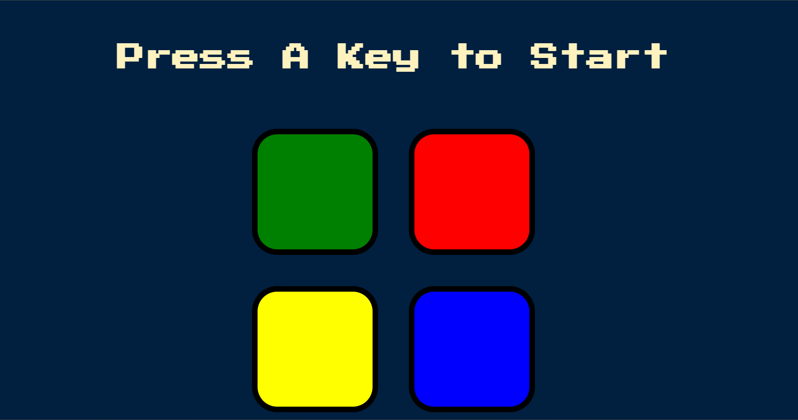
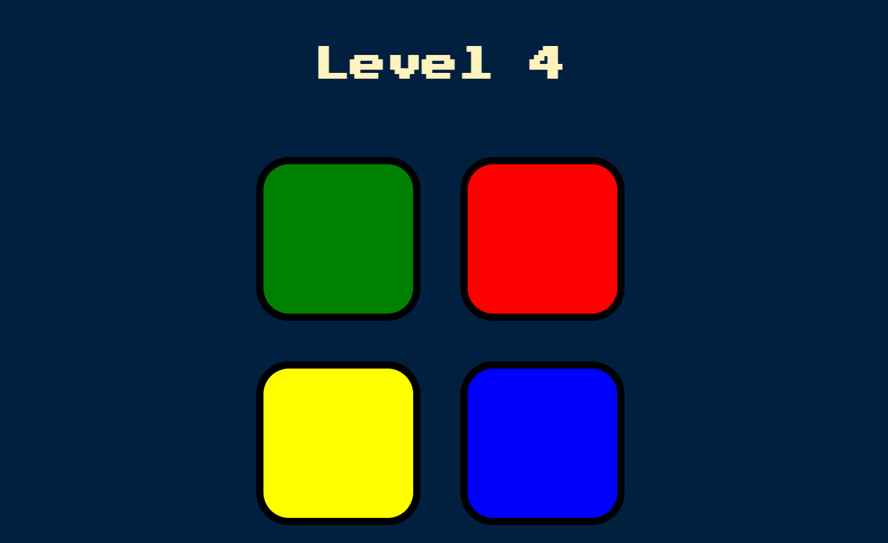
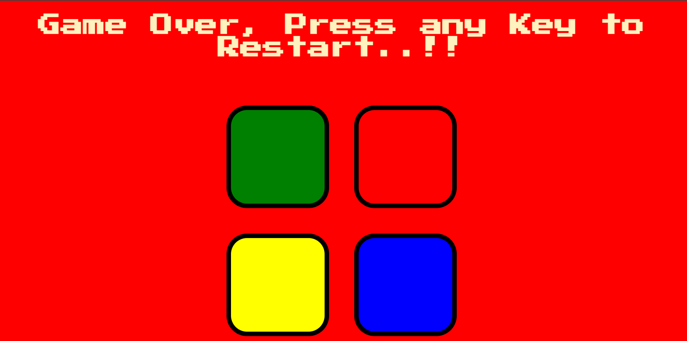

# Simon Game

Welcome to the Simon Game! This is a simple and fun memory game where you have to remember and repeat a sequence of colors. Each level gets progressively harder as the sequence grows longer. Test your memory and see how many levels you can complete!

## Features
- Clean and responsive UI
- Mobile Optimised (touch events are handled correctly)
- Colorful animations and sounds
- Increasing difficulty with each level
- Game Over and restart functionality

## Technologies Used
- HTML
- CSS
- JavaScript

## How to Play
1. Press any key to start the game.
2. Watch the color sequence.
3. Repeat the sequence by clicking on the colored buttons.
4. If you get the sequence correct, you'll move to the next level.
5. If you make a mistake, the game is over. Press any key to restart.

## Play the Game
You can play the game [here](https://niraj-kr-29.github.io/Simon-Game/).

## Screenshots

*Start screen of the game*

*Gameplay showing the sequence*

*Game over screen*

